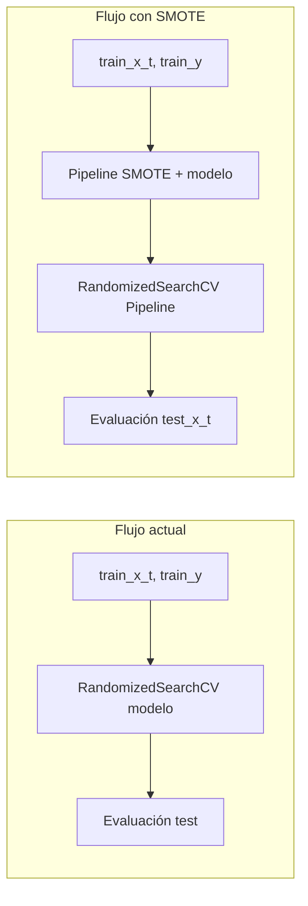

# Plan: SMOTE para balanceo y 3 modelos con optimización (bajo coste de cómputo)

## Contexto

- **Archivo:** [TPS_Dia_3_Machine_Learning.ipynb](c:\Agus\Primera Semana\TPS_Dia_3_Machine_Learning.ipynb)
- **Flujo actual:** `X, y` → `train_test_split` → `preprocessor.fit(train_x)` → `train_x_t`, `test_x_t` → modelos (DT, RF, XGBoost, LightGBM) con `RandomizedSearchCV(n_iter=25, cv=5)` y evaluación con umbral optimizado.
- **Objetivo:** Añadir una rama con SMOTE para mejorar AUPR, entrenando y optimizando solo **3 modelos** (Random Forest, XGBoost, LightGBM) con SMOTE, y controlando el tiempo de ejecución.

## 1. Dependencia

- Instalar o verificar **imbalanced-learn**: `pip install imbalanced-learn`
- Uso de `**imblearn.pipeline.Pipeline**` (no el de sklearn) para que SMOTE se aplique solo a los folds de entrenamiento dentro de la validación cruzada y nunca al test.

## 2. Dónde encaja SMOTE en el flujo

- **Entradas:** `train_x_t`, `train_y` (datos ya preprocesados por el ColumnTransformer).
- **Salidas:** Mismo esquema de evaluación (AUPR, F1, Precision, Recall, matriz de confusión, umbral optimizado) sobre **test_x_t**, **test_y** (sin tocar test).
- **Ubicación en el notebook:** Después de las celdas actuales de RF, XGBoost y LightGBM (sin SMOTE), añadir una sección nueva tipo “Modelos con SMOTE” con: 1 celda de configuración SMOTE + 3 celdas (una por modelo).

## 3. Estrategias para reducir tiempo de cómputo

| Estrategia        | Acción                                                      | Efecto                                                                    |
| ----------------- | ----------------------------------------------------------- | ------------------------------------------------------------------------- |
| Menos iteraciones | `n_iter=10` o `12` en RandomizedSearchCV para la rama SMOTE | Menos combinaciones por modelo (p. ej. 10 en lugar de 25).                |
| Menos folds       | `cv=3` en RandomizedSearchCV para la rama SMOTE             | Menos veces que se aplica SMOTE + fit por iteración (3 en lugar de 5).    |
| SMOTE más ligero  | `sampling_strategy=0.5` o `0.6` (no 1.0)                    | Menos muestras sintéticas; dataset de entrenamiento más pequeño y rápido. |
| Menos vecinos     | `k_neighbors=3` en SMOTE                                    | Menor coste de vecinos más cercanos (por defecto 5).                      |
| Mismo scoring     | `scoring="average_precision"`                               | Mantener AUPR como métrica de optimización.                               |

Con esto, cada modelo con SMOTE hace como máximo `10 * 3 = 30` ajustes (SMOTE + fit) en lugar de `25 * 5 = 125`, y cada SMOTE genera menos datos.

## 4. Configuración común SMOTE (una celda)

- Importar: `from imblearn.over_sampling import SMOTE` y `from imblearn.pipeline import Pipeline as ImbPipeline`.
- Definir parámetros reutilizables para SMOTE (para no repetir en cada modelo):
  - `smote_kwargs = dict(random_state=42, k_neighbors=3, sampling_strategy=0.6, n_jobs=-1)` (opcional `n_jobs=-1` si imblearn lo soporta en su versión).
- Documentar en comentario que `sampling_strategy=0.6` y `cv=3`, `n_iter=10` son para limitar tiempo; el usuario puede subirlos si tiene más capacidad.

## 5. Random Forest con SMOTE

- **Estimador:** `ImbPipeline([("smote", SMOTE(**smote_kwargs)), ("clf", RandomForestClassifier(class_weight="balanced", random_state=42))])`.
- **RandomizedSearchCV:** mismo `param_dist_rf` que en la rama sin SMOTE (o un subconjunto si se quiere aún más rápido), con prefijo `clf__` en las claves (p. ej. `clf__n_estimators`, `clf__max_depth`).
- **Búsqueda:** `n_iter=10`, `cv=3`, `scoring="average_precision"`, `random_state=42`, `refit=True`.
- **Fit:** `.fit(train_x_t, train_y)` (train_y numérico 0/1; si en el notebook se usa `train_y_num`, usar el mismo que en el resto).
- **Umbral:** Igual que ahora: `cross_val_predict(clone(pipeline_smote_rf), train_x_t, train_y, cv=3, method="predict_proba")` para obtener probabilidades OOF (el pipeline incluye SMOTE, así que en cada fold solo el train del fold se balancea), luego `optimizar_umbral(train_y, oof_proba)` y guardar `best_umbral_smote_rf`.
- **Evaluación:** `pred_smote_rf = pipeline_smote_rf.predict_proba(test_x_t)[:, 1]` y `evaluar_clasificador(test_y, pred_smote_rf, "Random Forest (SMOTE)", umbral=best_umbral_smote_rf)`.
- Guardar el pipeline en una variable distinta (p. ej. `pipeline_smote_rf` o `model_rf_smote`) para no pisar el RF sin SMOTE.

## 6. XGBoost con SMOTE

- **Estimador:** `ImbPipeline([("smote", SMOTE(**smote_kwargs)), ("clf", XGBClassifier(scale_pos_weight=scale_pos_weight, random_state=42, ...))])`.
- **RandomizedSearchCV:** mismo `param_dist_xgb` con prefijo `clf__`, `n_iter=10`, `cv=3`, `scoring="average_precision"`.
- Mismo flujo: fit en `train_x_t`, `train_y`; OOF con `cross_val_predict(..., cv=3)` para umbral; evaluación en test con `evaluar_clasificador(..., umbral=best_umbral_smote_xgb)`.
- Variable: p. ej. `pipeline_smote_xgb` o `model_xgb_smote`.

## 7. LightGBM con SMOTE

- **Estimador:** `ImbPipeline([("smote", SMOTE(**smote_kwargs)), ("clf", LGBMClassifier(scale_pos_weight=scale_pos_weight, random_state=42))])`.
- **RandomizedSearchCV:** mismo `param_dist_lgb` con prefijo `clf__`, `n_iter=10`, `cv=3`, `scoring="average_precision"`.
- Mismo flujo: fit, OOF para umbral (cv=3), evaluación en test.
- Variable: p. ej. `pipeline_smote_lgb` o `model_lgb_smote`.

## 8. Comparación con modelos sin SMOTE

- Añadir una celda (opcional pero recomendable) que construya un pequeño resumen comparando, para los 3 modelos, las métricas **sin SMOTE** vs **con SMOTE** (AUPR, F1, Precision, Recall), por ejemplo en un `pd.DataFrame` con columnas: Modelo, AUPR_sin_SMOTE, AUPR_con_SMOTE, F1_sin, F1_con, etc., reutilizando los resultados ya mostrados por `evaluar_clasificador` o guardando sus returns en variables para esta tabla.

## 9. Orden sugerido de celdas

1. Celda markdown: “Modelos con SMOTE (RF, XGBoost, LightGBM)”.
2. Celda código: imports imblearn + definición de `smote_kwargs` (y opcionalmente constantes `N_ITER_SMOTE=10`, `CV_SMOTE=3`).
3. Celda: Random Forest con Pipeline SMOTE + RandomizedSearchCV + umbral + evaluación.
4. Celda: XGBoost con Pipeline SMOTE + RandomizedSearchCV + umbral + evaluación.
5. Celda: LightGBM con Pipeline SMOTE + RandomizedSearchCV + umbral + evaluación.
6. Celda (opcional): DataFrame comparativo sin SMOTE vs con SMOTE.

## 10. Detalles técnicos

- **Target numérico:** Asegurar que `train_y` (o `train_y_num`) sea 0/1 en todas las celdas SMOTE; si el notebook usa `train_y_num` en algún modelo, usar el mismo criterio aquí.
- **Predicción en producción:** El pipeline guardado (SMOTE + modelo) al hacer `predict` o `predict_proba` no rebalancea; imblearn Pipeline aplica SMOTE solo en `fit`, por lo que es seguro usar ese pipeline para predecir en `test_x_t` o en datos nuevos transformados con el mismo `preprocessor`.
- **Reproducibilidad:** `random_state=42` en SMOTE, en RandomizedSearchCV y en los modelos.
- Si el tiempo sigue siendo alto: bajar a `n_iter=6` y `cv=3`, o subir `sampling_strategy` a 0.4 para generar aún menos muestras sintéticas.

## 11. Resumen de parámetros “ligeros” recomendados

- **SMOTE:** `random_state=42`, `k_neighbors=3`, `sampling_strategy=0.6`.
- **RandomizedSearchCV (rama SMOTE):** `n_iter=10`, `cv=3`, `scoring="average_precision"`, `random_state=42`.
- **Umbral:** Misma función `optimizar_umbral`; para OOF usar `cv=3` en `cross_val_predict` para ser coherente con el CV de la búsqueda.

