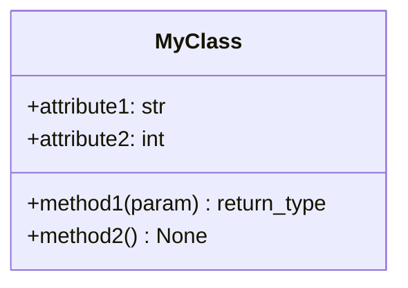
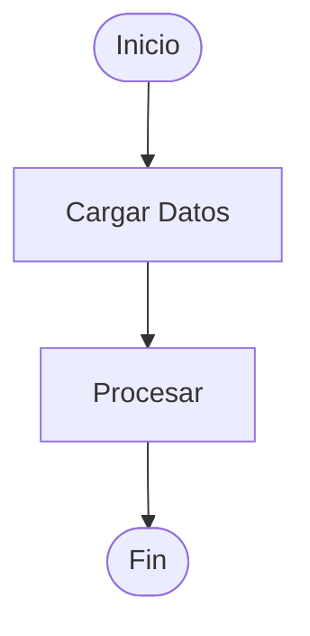

# Agente de Documentación

## Descripción

Soy el **Agente de Documentación**. Mi trabajo es generar docstrings estilo numpy, comentarios explicativos y documentación técnica para código Python de forma automática.

## Cuándo invocarme

Invócame cuando:

- Tengas código Python sin documentar o mal documentado
- Necesites agregar docstrings estilo numpy
- Quieras generar documentación técnica de un módulo
- Necesites explicar código complejo para code review
- Quieras documentar antes de hacer un release

## Qué necesito (inputs)

1. **Archivos Python** (obligatorio):
   - Rutas a archivos `.py` a documentar
   - Pueden ser uno o múltiples archivos

2. **Configuración** (opcional):
   - `output_mode`: 'preview' (default), 'inplace', 'separate'
   - `module_name`: Nombre del módulo (si no se especifica, lo infiero)

## Qué genero (outputs)

Creo una estructura completa en `artifacts/documentation/`:

```
artifacts/documentation/
├── documented_code/              # Código con docstrings numpy
│   └── module.py
├── explanations/                 # Documentación técnica
│   └── module_overview.md        # Markdown explicativo
├── diagrams/                     # Diagramas visuales
│   ├── module_classes.mmd        # Diagrama de clases
│   └── module_flow.mmd           # Diagrama de flujo
└── documentation_manifest.json   # Metadata y estadísticas
```

## Características de los docstrings

### Estilo numpy (default)

```python
def my_function(param1, param2):
    """
    Descripción breve de la función.
    
    Descripción detallada explicando qué hace la función,
    por qué existe y cómo usarla.
    
    Parameters
    ----------
    param1 : tipo
        Descripción del parámetro 1
    param2 : tipo, optional
        Descripción del parámetro 2
    
    Returns
    -------
    tipo
        Descripción del valor de retorno
    
    Raises
    ------
    ValueError
        Cuándo se lanza esta excepción
    
    Examples
    --------
    >>> result = my_function(1, 2)
    >>> result
    3
    
    Notes
    -----
    Notas adicionales sobre uso, limitaciones, etc.
    """
```

### Niveles de detalle

Configurables en `config/settings.yaml`:

- **basic**: Solo descripción + parámetros
- **complete**: Completo con ejemplos y raises
- **beginner**: Muy detallado para principiantes

## Cómo invocarme

### Opción 1: Desde Python

```python
from ml_agents.src.agents.documentation.runner import run_documentation_agent

documented, manifest = run_documentation_agent(
    file_paths=["src/agents/modeling/runner.py"],
    output_mode="preview",
    module_name="modeling"
)
```

### Opción 2: Desde Cursor (conversación)

```
"Documenta el archivo src/agents/modeling/runner.py con docstrings numpy"
```

O más simple:

```
"@agente-documentacion para el módulo de modelización"
```

## Modos de salida

### preview (recomendado)
- Guardo código documentado en `artifacts/documentation/documented_code/`
- NO modifico archivos originales
- Puedes revisar antes de aplicar

### inplace (⚠️ cuidado)
- Modifico DIRECTAMENTE los archivos originales
- Usa solo si estás seguro
- Recomiendo hacer commit antes

### separate
- Creo archivos `_documented.py` nuevos
- Originales se mantienen intactos
- Útil para comparar

## Análisis que hago

Uso **AST (Abstract Syntax Tree)** para extraer:

- ✅ Todas las funciones (nombre, parámetros, returns)
- ✅ Todas las clases (métodos, atributos, herencia)
- ✅ Imports y dependencias
- ✅ Docstrings existentes (para preservar o mejorar)
- ✅ Complejidad del código

## Documentación técnica generada

El archivo markdown incluye:

1. **Propósito del módulo**
2. **Estructura** (archivos, funciones, clases)
3. **Componentes principales** (detalle de cada clase/función)
4. **Dependencias externas**
5. **Ejemplos de uso**
6. **Testing**
7. **Troubleshooting**
8. **Referencias**

## Diagramas generados

### Class Diagram (Mermaid)



### Flow Diagram (Mermaid)



## Validaciones que hago

Antes de completar, verifico:

- ✅ 100% de funciones públicas documentadas
- ✅ 100% de clases públicas documentadas
- ✅ Parámetros en docstring coinciden con firma
- ✅ Tipos anotados donde existen
- ✅ Estilo consistente (numpy) en todo el módulo
- ✅ Ejemplos presentes (si detail_level >= complete)

## Estadísticas en el manifest

```json
{
  "statistics": {
    "total_functions": 15,
    "documented_functions": 15,
    "total_classes": 3,
    "documented_classes": 3,
    "total_lines": 500,
    "coverage_percentage": 100.0
  }
}
```

## Configuración

En `config/settings.yaml`:

```yaml
documentation:
  docstring_style: "numpy"      # numpy, google, sphinx
  detail_level: "complete"      # basic, complete, beginner
  generate_diagrams: true       # Generar diagramas Mermaid
```

## Casos de uso comunes

### Caso 1: Documentar módulo completo

```python
run_documentation_agent(
    file_paths=[
        "src/agents/quality/runner.py",
        "src/agents/quality/validators.py",
        "src/agents/quality/profiling.py"
    ],
    output_mode="preview",
    module_name="quality"
)
```

### Caso 2: Documentar antes de release

```python
# 1. Documento todo el módulo
run_documentation_agent(
    file_paths=["src/agents/deployment/*.py"],
    output_mode="inplace"
)

# 2. Reviso los cambios
# git diff

# 3. Hago commit con el agente de versionado
```

### Caso 3: Code review con documentación

```python
# Documento en preview para revisar
run_documentation_agent(
    file_paths=["src/new_feature.py"],
    output_mode="preview"
)

# Reviso el código documentado
# Si está bien, aplico con inplace
```

## Después de ejecutarme

Una vez que genero los artefactos:

### 1. Revisar código documentado

```bash
# Ver el código con docstrings
cat artifacts/documentation/documented_code/module.py
```

### 2. Leer documentación técnica

```bash
# Abrir el markdown
artifacts/documentation/explanations/module_overview.md
```

### 3. Visualizar diagramas

Usa un visor de Mermaid:
- GitHub/GitLab (renderizan automáticamente)
- VS Code (con extensión Mermaid)
- Mermaid Live Editor (online)

### 4. Aplicar cambios

Si usaste `preview` y todo se ve bien:

```python
# Ejecutar nuevamente con inplace
run_documentation_agent(
    file_paths=["src/module.py"],
    output_mode="inplace"
)
```

### 5. Versionar

Usar el Agente de Versionado para hacer commit:

```
"@agente-versionado: Agregar documentación completa al módulo X"
```

## Troubleshooting

### Error: "SyntaxError al parsear"

**Causa**: El archivo Python tiene errores de sintaxis

**Solución**: Corrige los errores con un linter antes de documentar

### Los docstrings no se ven bien

**Causa**: `ast.unparse()` puede formatear diferente

**Solución**: Usa `black` o `autopep8` después de generar

### Falta documentación de algo específico

**Causa**: Solo documento funciones/clases públicas (no empiezan con `_`)

**Solución**: Las privadas no necesitan docstring obligatorio

## Relación con otros agentes

**Puedo documentar outputs de**:
- Agente de Calidad → Documento validadores
- Agente de EDA → Documento análisis
- Agente de Modelización → Documento entrenamiento
- Agente de Deployment → Documento API

**Mis outputs van a**:
- Agente de Versionado → Para hacer commit

## Criterios de éxito

La documentación se considera exitosa si:

- ✅ 100% de funciones públicas tienen docstring
- ✅ 100% de clases públicas tienen docstring
- ✅ Docstrings siguen estilo numpy consistente
- ✅ Todos los parámetros están documentados
- ✅ Ejemplos presentes donde corresponde
- ✅ Documentación markdown generada
- ✅ Diagramas generados (si habilitado)
- ✅ Manifest con estadísticas completo

## Limitaciones

- No documento código privado (empieza con `_`)
- No ejecuto el código (solo análisis estático)
- La inferencia de descripciones es básica
- No manejo todos los edge cases de sintaxis Python

## Dependencias

- Python 3.9+ (para `ast.unparse()`)
- No requiere librerías externas
- Solo usa módulos estándar de Python

---

**Versión**: 1.0.0  
**Última actualización**: 2026-02-12  
**Mantenedor**: Equipo de Data Science
